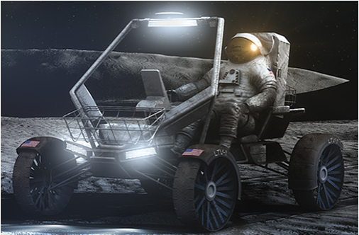
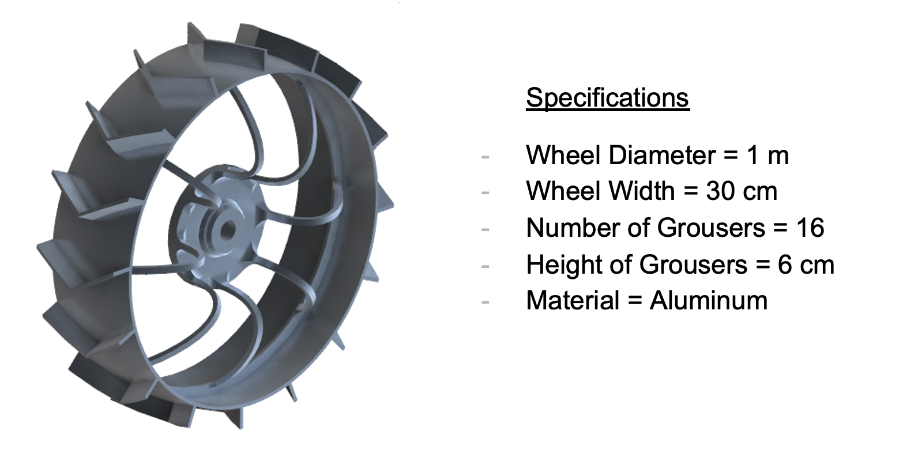
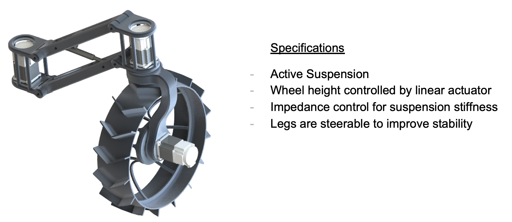
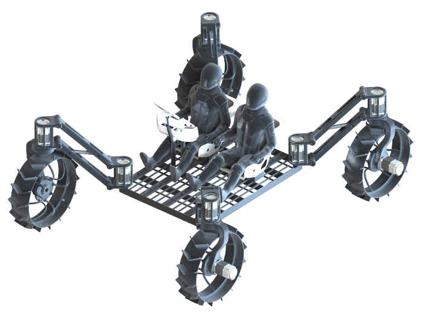
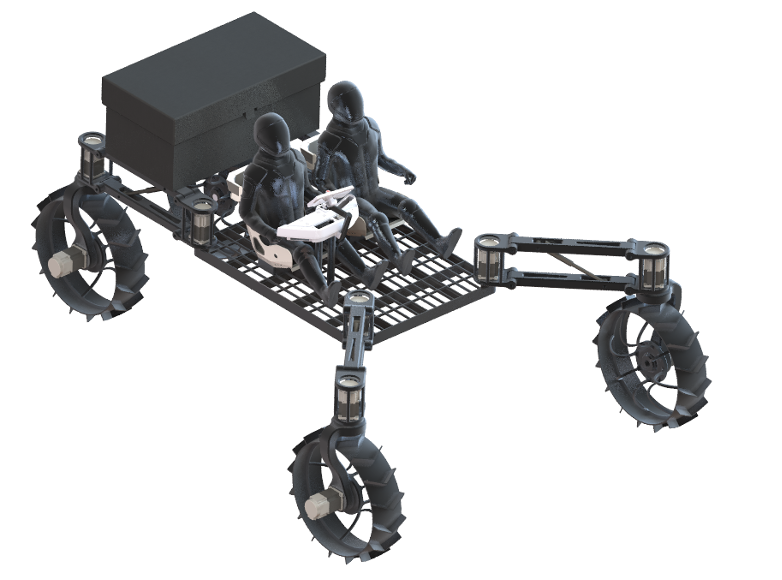
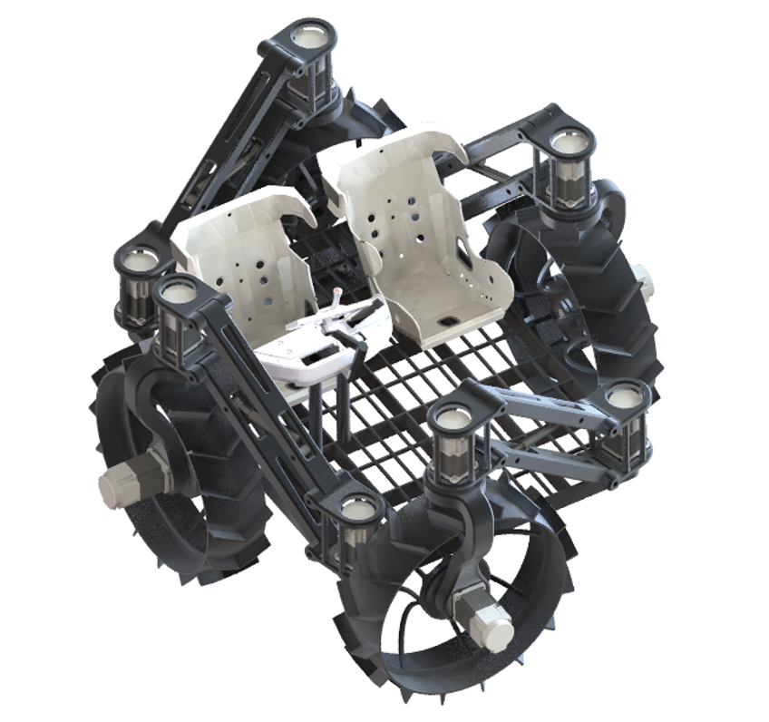
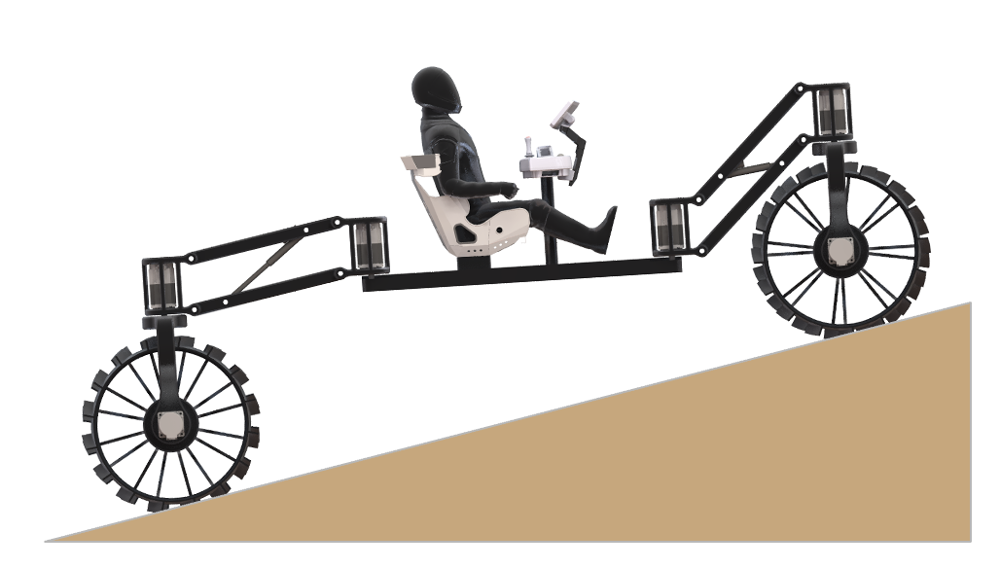
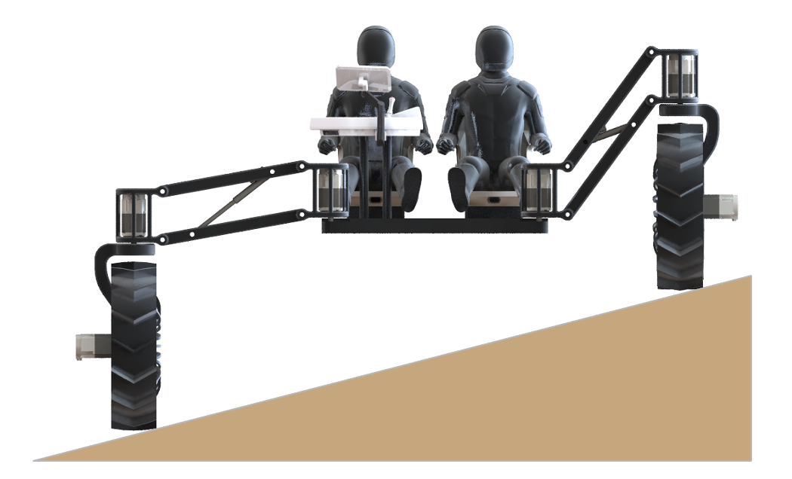

# Lunar Terrain Vehicle Design Project

## Artemis LTV Mission

In August 2021, NASA revealed initial details on its plan to purchase a commercial rover which Artemis astronauts will drive on the Moon later this decade. Inspired by this, my team presented a preliminary design solution as part of the course ENAE788x: Planetary Surface Robotics.

     
  <!---  -->

The LTV will be an unenclosed, all-electric rover that two suited astronauts can drive on the Moon for up to 20 kilometers on a 8-hour roundtrip without the rover needing a recharge. That’s roughly thrice Apollo LRV’s range and twice its drive time. Performance requirements can be found below:

<!---
 Two suited crew members plus 500 kg of cargo
- Max speed of 15 km/h
- Traverse 20 km on a single charge
- Survive 100 hours of polar nighttime
- Should be able to climb a 15 deg slope
- Support 8 hours of EVA -->

    

## Wheel Design

  

## Suspension Design

  

## Final Rover Design Solution

The extensive details of the design can be found in the following [presentation](ENAE788x_TermProject_LTV.pdf). The presentation covers the analysis and trade studies performed in the realm of the following topics:

- Terramechanics 
- Wheel Design
- Suspension
- Stability
- Motor Requirements
- Sensors 
- Path Planning Strategies
- Power Requirements 

| Normal Configuration  |  Cargo Configuration | Storage Configuration |
:-------------------------:|:-------------------------:|:-------------------------:
 |   |  

Uphill Configuration  |  Sideways Configuration 
:-------------------------:|:-------------------------:
 |   
